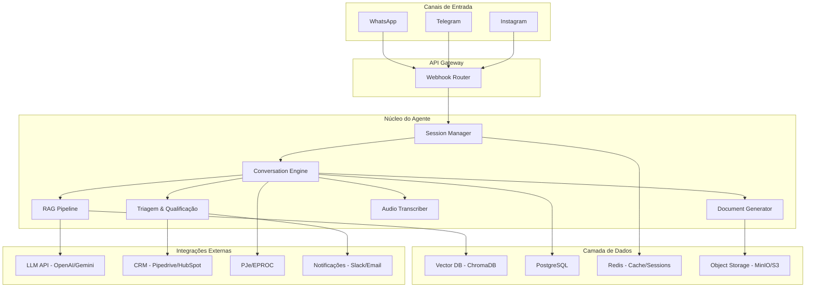
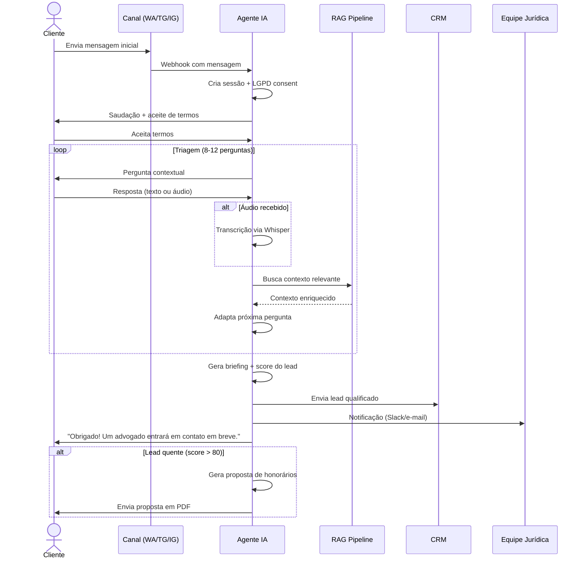
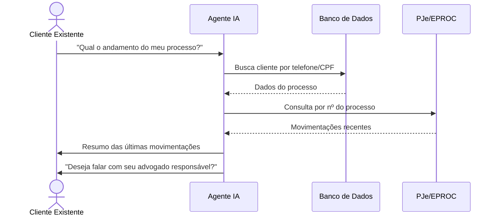

# PRD — Agente Jurídico com IA (GeanAI Legal Agent)

**Versão:** 1.0  
**Data:** 28/02/2026  
**Autor:** Analista de Produto (IA)  
**Status:** Em revisão  

---

## 1. Visão Geral

### 1.1 Problema
Escritórios de advocacia perdem potenciais clientes por demora na resposta inicial, triagem manual ineficiente e falta de presença nos canais digitais mais utilizados. Além disso, clientes existentes frequentemente ligam para saber sobre andamento processual, consumindo tempo da equipe.

### 1.2 Solução
Um **agente conversacional jurídico** que opera em WhatsApp, Telegram e Instagram, capaz de:
- Captar e qualificar leads automaticamente
- Gerar documentos e propostas
- Consultar andamento processual (PJe/EPROC)
- Fazer handoff inteligente para humanos

### 1.3 Público-Alvo
| Persona | Descrição |
|---|---|
| **Cliente potencial** | Pessoa física/jurídica buscando orientação jurídica |
| **Cliente existente** | Já possui processo em andamento no escritório |
| **Advogado/Equipe** | Recebe briefings qualificados e gerencia atendimentos |

---

## 2. Análise de Viabilidade Técnica

### 2.1 Viabilidade por Componente

| Componente | Viabilidade | Complexidade | Observações |
|---|---|---|---|
| Integração WhatsApp | ✅ Alta | Média | Via WhatsApp Business API (Meta Cloud API) ou provedor (Twilio, Z-API) |
| Integração Telegram | ✅ Alta | Baixa | Bot API nativa, bem documentada |
| Integração Instagram | ✅ Alta | Média | Via Instagram Messaging API (requer aprovação Meta) |
| RAG com base própria | ✅ Alta | Média | LangChain/LlamaIndex + vector store (Qdrant, Pinecone, ChromaDB) |
| Transcrição de áudio | ✅ Alta | Baixa | OpenAI Whisper API ou Google Speech-to-Text |
| Geração de documentos | ✅ Alta | Média | Templates DOCX via `docxtpl` ou `python-docx` |
| Consulta PJe/EPROC | ⚠️ Média | Alta | PJe não tem API pública oficial — requer web scraping ou MNI (Modelo Nacional de Interoperabilidade) |
| Handoff para humano | ✅ Alta | Média | Estado da conversa + notificação via webhook/CRM |
| CRM Integration | ✅ Alta | Média | API REST para integração com Pipedrive, HubSpot ou CRM próprio |

### 2.2 Riscos Técnicos Críticos

> [!CAUTION]
> **Consulta PJe/EPROC**: O PJe não disponibiliza API pública robusta. A integração depende do MNI (SOAP/XML) ou scraping autorizado. Recomenda-se iniciar com consulta manual assistida e evoluir para integração automatizada após validação jurídica do acesso. **É mandatório o uso de um Vault para armazenamento seguro de certificados digitais (A1/A3) dos advogados.**

> [!WARNING]
> **Conformidade LGPD**: Todo dado pessoal coletado deve seguir as diretrizes da LGPD. É necessário consentimento explícito antes da coleta e armazenamento seguro com criptografia. **Dados em bancos vetoriais devem ser vinculados ao UserID para permitir o expurgo seletivo (Direito ao Esquecimento).**

> [!IMPORTANT]
> **Limites da IA**: O agente **não pode fornecer aconselhamento jurídico**. Deve sempre deixar claro que é um assistente virtual e que as orientações finais cabem aos advogados do escritório.

---

## 3. Requisitos Funcionais

### 3.1 Atendimento Multicanal

| ID | Requisito | Prioridade |
|---|---|---|
| F01 | Receber e responder mensagens via WhatsApp Business API | P0 |
| F02 | Receber e responder mensagens via Telegram Bot | P0 |
| F03 | Receber e responder mensagens via Instagram DM | P1 |
| F04 | Manter sessão/contexto unificado por cliente independente do canal | P0 |
| F05 | Identificar cliente recorrente (por telefone/e-mail) | P1 |
| F29 | Vincular IDs internos (Instagram) a identificadores únicos (CPF/E-mail) para unificação de jornada | P0 |
| F30 | Implementar fluxo de reconhecimento de usuário cross-channel | P1 |

### 3.2 Triagem Inteligente

| ID | Requisito | Prioridade |
|---|---|---|
| F06 | Realizar de 8 a 12 perguntas contextuais adaptativas | P0 |
| F07 | Classificar área jurídica (trabalhista, cível, família, criminal, etc.) | P0 |
| F08 | Avaliar urgência do caso (alta, média, baixa) | P0 |
| F09 | Gerar score de qualificação do lead (0-100) | P1 |
| F10 | Adaptar perguntas com base nas respostas anteriores | P0 |

### 3.3 Base de Conhecimento (RAG)

| ID | Requisito | Prioridade |
|---|---|---|
| F11 | Responder dúvidas com base em FAQ do escritório | P0 |
| F12 | Consultar jurisprudência indexada para contextualizar respostas | P1 |
| F13 | Utilizar templates de documentos como referência | P1 |
| F14 | Atualização periódica da base via painel admin ou upload | P2 |
| F31 | Camada de verificação (Self-RAG) para validar se a resposta está contida no contexto recuperado | P0 |
| F32 | Atribuição de Confidence Score para cada resposta gerada pela IA | P1 |

### 3.4 Transcrição de Áudio

| ID | Requisito | Prioridade |
|---|---|---|
| F15 | Transcrever áudios recebidos via WhatsApp/Telegram | P0 |
| F16 | Processar transcrição como input para o fluxo conversacional | P0 |
| F17 | Armazenar transcrição junto ao histórico da conversa | P1 |

### 3.5 Geração de Documentos

| ID | Requisito | Prioridade |
|---|---|---|
| F18 | Gerar propostas de honorários com base em templates | P0 |
| F19 | Gerar contratos de prestação de serviços pré-preenchidos | P1 |
| F20 | Exportar briefing estruturado em PDF | P0 |
| F21 | Enviar documentos gerados pelo canal de atendimento | P1 |

### 3.6 Handoff Humano

| ID | Requisito | Prioridade |
|---|---|---|
| F22 | Transferir conversa para humano com todo o histórico | P0 |
| F23 | Notificar equipe via e-mail/Slack/webhook quando handoff ocorrer | P0 |
| F24 | Permitir que humano assuma e devolva conversa à IA | P1 |
| F25 | Integrar briefing ao CRM automaticamente | P0 |

### 3.7 Consulta Processual

| ID | Requisito | Prioridade |
|---|---|---|
| F26 | Consultar andamento processual por número do processo | P1 |
| F27 | Enviar notificações proativas de movimentação | P2 |
| F28 | Suportar consulta a PJe e EPROC | P2 |

---

## 4. Requisitos Não-Funcionais

| ID | Requisito | Meta |
|---|---|---|
| NF01 | Tempo de resposta da IA | < 3 segundos (p95) |
| NF02 | Disponibilidade | 99.5% uptime |
| NF03 | Segurança de dados | Criptografia AES-256 em repouso, TLS 1.3 em trânsito |
| NF04 | Conformidade LGPD | Consentimento explícito, direito ao esquecimento, DPO definido |
| NF05 | Escalabilidade | Suportar 500 conversas simultâneas na v1 |
| NF06 | Observabilidade | Logs estruturados, métricas de latência, rastreamento de erros |
| NF07 | Idioma | Português brasileiro (pt-BR) |
| NF08 | Retenção de dados | Histórico mantido por 5 anos (conformidade jurídica) |

---

## 5. Arquitetura do Sistema

### 5.1 Diagrama de Alto Nível



### 5.2 Stack Tecnológico

| Camada | Tecnologia | Justificativa |
|---|---|---|
| **Runtime** | Python 3.12+ | Ecossistema de IA maduro, LangChain, FastAPI |
| **Framework Web** | FastAPI | Alta performance, async nativo, tipagem |
| **Orquestração LLM** | LangChain / LangGraph | Fluxos conversacionais com estado, RAG integrado |
| **LLM** | OpenAI GPT-4o ou Google Gemini 2.0 | Melhor compreensão de contexto jurídico em PT-BR |
| **Vector Store** | ChromaDB (dev) → Qdrant (prod) | ChromaDB para prototipagem rápida, Qdrant para produção |
| **Banco de Dados** | PostgreSQL 16 | Robusto, JSONB para dados semi-estruturados |
| **Cache/Sessões** | Redis 7 | Gerenciamento de sessões, rate limiting |
| **Transcrição** | OpenAI Whisper API | Melhor accuracy para PT-BR |
| **Documentos** | `python-docx` + `weasyprint` | Geração DOCX e conversão PDF |
| **Object Storage** | MinIO (self-hosted) ou AWS S3 | Armazenamento de áudios, documentos gerados |
| **Containerização** | Docker + Docker Compose | Ambiente consistente dev/prod |
| **CI/CD** | GitHub Actions | Automação de deploy |
| **Observabilidade** | Sentry + Prometheus + Grafana | Erros, métricas, dashboards |
| **Segurança** | HashiCorp Vault ou AWS Secrets Manager | Gestão de certificados digitais e tokens |
| **Guardrails** | NeMo Guardrails ou Self-RAG customizado | Proteção contra alucinações e vazamento de dados |

---

## 6. Estrutura de Pastas

```
gean-legal-agent/
├── .github/
│   └── workflows/
│       ├── ci.yml                    # Lint, testes, build
│       └── deploy.yml                # Deploy automático
├── src/
│   ├── main.py                       # Entry point FastAPI
│   ├── config/
│   │   ├── settings.py               # Configurações com Pydantic Settings
│   │   └── logging.py                # Configuração de logs
│   ├── channels/                     # Adaptadores de canal
│   │   ├── __init__.py
│   │   ├── base.py                   # Interface abstrata de canal
│   │   ├── whatsapp.py               # WhatsApp Business API
│   │   ├── telegram.py               # Telegram Bot API
│   │   └── instagram.py              # Instagram Messaging API
│   ├── core/                         # Lógica central do agente
│   │   ├── __init__.py
│   │   ├── agent.py                  # Orquestrador principal (LangGraph)
│   │   ├── conversation.py           # Gerenciamento de estado da conversa
│   │   ├── prompts.py                # System prompts e templates de prompt
│   │   └── personality.py            # Definição de personalidade da IA
│   ├── triage/                       # Módulo de triagem
│   │   ├── __init__.py
│   │   ├── questions.py              # Banco de perguntas por área jurídica
│   │   ├── qualifier.py              # Motor de qualificação de leads
│   │   └── classifier.py             # Classificador de área jurídica
│   ├── rag/                          # Pipeline RAG
│   │   ├── __init__.py
│   │   ├── embeddings.py             # Geração de embeddings
│   │   ├── retriever.py              # Busca vetorial
│   │   ├── indexer.py                # Indexação de documentos
│   │   └── chains.py                 # Chains de Q&A com RAG
│   ├── documents/                    # Geração de documentos
│   │   ├── __init__.py
│   │   ├── generator.py              # Motor de geração
│   │   ├── templates/                # Templates DOCX
│   │   │   ├── proposta_honorarios.docx
│   │   │   ├── contrato_servicos.docx
│   │   │   └── briefing.docx
│   │   └── pdf_converter.py          # Conversão DOCX → PDF
│   ├── audio/                        # Transcrição de áudio
│   │   ├── __init__.py
│   │   └── transcriber.py            # Integração Whisper
│   ├── integrations/                 # Integrações externas
│   │   ├── __init__.py
│   │   ├── crm.py                    # Integração CRM
│   │   ├── pje.py                    # Consulta PJe
│   │   ├── eproc.py                  # Consulta EPROC
│   │   └── notifications.py          # Slack, e-mail etc.
│   ├── handoff/                      # Módulo de handoff
│   │   ├── __init__.py
│   │   ├── manager.py                # Gerenciamento de transferência
│   │   └── queue.py                  # Fila de atendimento humano
│   ├── models/                       # Modelos de dados
│   │   ├── __init__.py
│   │   ├── conversation.py           # Modelo de conversa
│   │   ├── lead.py                   # Modelo de lead
│   │   ├── document.py               # Modelo de documento
│   │   └── process.py                # Modelo de processo judicial
│   ├── database/                     # Camada de persistência
│   │   ├── __init__.py
│   │   ├── connection.py             # Pool de conexões
│   │   ├── repositories/             # Repositórios
│   │   │   ├── conversation_repo.py
│   │   │   ├── lead_repo.py
│   │   │   └── document_repo.py
│   │   └── migrations/               # Migrações Alembic
│   │       └── versions/
│   └── api/                          # Endpoints REST
│       ├── __init__.py
│       ├── webhooks.py               # Webhooks dos canais
│       ├── admin.py                   # Endpoints administrativos
│       └── health.py                 # Health check
├── knowledge_base/                   # Base de conhecimento para RAG
│   ├── faq/                          # Perguntas frequentes
│   │   ├── trabalhista.md
│   │   ├── civil.md
│   │   ├── familia.md
│   │   ├── criminal.md
│   │   └── previdenciario.md
│   ├── jurisprudencia/               # Jurisprudência relevante
│   │   └── README.md
│   ├── templates_texto/              # Templates de respostas
│   │   ├── saudacao.md
│   │   ├── encerramento.md
│   │   └── handoff.md
│   └── institucional/                # Sobre o escritório
│       ├── areas_atuacao.md
│       ├── equipe.md
│       └── valores_honorarios.md
├── tests/
│   ├── unit/
│   │   ├── test_triage.py
│   │   ├── test_rag.py
│   │   ├── test_documents.py
│   │   └── test_transcriber.py
│   ├── integration/
│   │   ├── test_whatsapp.py
│   │   ├── test_telegram.py
│   │   └── test_crm.py
│   └── e2e/
│       └── test_full_flow.py
├── docker/
│   ├── Dockerfile
│   └── docker-compose.yml
├── scripts/
│   ├── seed_knowledge_base.py        # Script para popular base de conhecimento
│   └── setup_dev.sh                  # Setup do ambiente de desenvolvimento
├── .env.example
├── pyproject.toml
├── requirements.txt
└── README.md
```

---

## 7. Fluxos de Usuário

### 7.1 Fluxo Principal — Captação de Lead



### 7.2 Fluxo — Consulta Processual (Pós-venda)



### 7.3 Perguntas de Triagem — Exemplo (Área Trabalhista)

| # | Pergunta | Objetivo |
|---|---|---|
| 1 | Qual seu nome completo? | Identificação |
| 2 | Qual a cidade e estado onde trabalha/trabalhou? | Jurisdição |
| 3 | Qual o tipo de vínculo? (CLT, PJ, temporário) | Classificação |
| 4 | Há quanto tempo trabalha/trabalhou na empresa? | Contexto |
| 5 | Qual o motivo do contato? (demissão, acidente, assédio, etc.) | Área específica |
| 6 | Já recebeu todas as verbas rescisórias? | Urgência/valores |
| 7 | Possui documentos como CTPS, contracheques, contrato? | Provas disponíveis |
| 8 | Já consultou outro advogado sobre este caso? | Situação atual |
| 9 | Há alguma ação judicial em andamento? | Conflito de interesse |
| 10 | Tem urgência no atendimento? (prazo prescricional, audiência) | Priorização |

---

## 8. Personalidade do Agente

### 8.1 Diretrizes de Tom e Voz

```yaml
nome: "Assistente Jurídico GeanAI"
tom: "Profissional, acolhedor e empático"
linguagem: "Formal, mas simplificada — evita juridiquês"
regras:
  - Nunca fornecer aconselhamento jurídico direto
  - Sempre esclarecer que é um assistente virtual
  - Usar linguagem inclusiva e acessível
  - Demonstrar empatia em situações sensíveis
  - Manter sigilo sobre informações de outros clientes
exemplos:
  saudacao: |
    Olá! 👋 Sou o assistente virtual do escritório [Nome].
    Estou aqui para entender sua situação e conectar você
    com o advogado mais indicado para o seu caso.
    Antes de começarmos, preciso que você aceite nossos
    termos de uso e política de privacidade: [link]
  empatia: |
    Entendo que essa é uma situação difícil. Saiba que
    estamos aqui para ajudar. Vou fazer algumas perguntas
    para encaminhar seu caso da melhor forma possível.
  limite: |
    Essa é uma questão que precisa ser analisada por um
    dos nossos advogados. Vou encaminhar seu caso para
    a equipe especializada.
```

---

## 9. Base de Conhecimento Inicial

### 9.1 O que indexar primeiro (MVP)

| Categoria | Conteúdo | Formato | Volume estimado |
|---|---|---|---|
| **FAQ** | Perguntas frequentes por área (5 áreas × 20 perguntas) | Markdown | ~100 documentos |
| **Institucional** | Áreas de atuação, equipe, localização, honorários base | Markdown | ~10 documentos |
| **Templates de resposta** | Saudação, encerramento, handoff, LGPD | Markdown | ~15 documentos |
| **Jurisprudência** | Súmulas relevantes (TST, STJ), jurisprudência selecionada | PDF/Markdown | ~50 documentos |
| **Legislação** | Artigos mais citados (CLT, CC, CDC, CP) | Markdown | ~30 documentos |

### 9.2 Estratégia de Chunking

```
Tipo de documento  → Chunk size  → Overlap
FAQ                → 512 tokens → 50 tokens
Jurisprudência     → 1024 tokens → 128 tokens
Legislação         → 768 tokens → 100 tokens
Institucional      → 256 tokens → 32 tokens
```

### 9.3 Metadados por Chunk

```json
{
  "source": "faq/trabalhista.md",
  "area_juridica": "trabalhista",
  "tipo": "faq",
  "data_atualizacao": "2026-02-28",
  "tags": ["rescisao", "verbas", "clt"]
}
```

---

## 10. Riscos e Mitigações

| # | Risco | Impacto | Probabilidade | Mitigação |
|---|---|---|---|---|
| 1 | IA fornecer conselho jurídico indevido | Crítico | Média | Guardrails no prompt, revisão periódica, disclaimer obrigatório |
| 2 | Vazamento de dados pessoais (LGPD) | Crítico | Baixa | Criptografia, auditoria, DPO, pen-test |
| 3 | PJe/EPROC indisponível ou bloquear acesso | Alto | Alta | Fallback para consulta manual, cache de dados recentes |
| 4 | Alucinação da LLM em respostas jurídicas | Alto | Média | RAG com retrieval obrigatório, confidence threshold, fallback para humano |
| 5 | Custo elevado de API (tokens LLM) | Médio | Média | Cache de respostas frequentes, modelo menor para triagem, rate limiting |
| 6 | Latência alta na resposta | Médio | Baixa | Streaming de respostas, otimização de prompts, Redis cache |
| 7 | Reprovação da conta WhatsApp Business | Alto | Baixa | Seguir políticas Meta rigorosamente, templates aprovados |

---

## 11. Roadmap de Implementação

### Fase 1 — MVP (Semanas 1–4)
- [x] Setup do projeto (estrutura, Docker, CI)
- [ ] Integração WhatsApp Business API
- [ ] Motor de conversação básico (LangGraph)
- [ ] Triagem com 8 perguntas fixas
- [ ] RAG com FAQ inicial (5 áreas)
- [ ] Geração de briefing em PDF
- [ ] Handoff simples (notificação e-mail)

### Fase 2 — Expansão (Semanas 5–8)
- [ ] Integração Telegram
- [ ] Transcrição de áudio (Whisper)
- [ ] Triagem adaptativa (perguntas dinâmicas)
- [ ] Geração de propostas e contratos
- [ ] Integração CRM (Pipedrive/HubSpot)
- [ ] Painel admin básico para base de conhecimento

### Fase 3 — Maturidade (Semanas 9–12)
- [ ] Integração Instagram
- [ ] Consulta processual (PJe/EPROC)
- [ ] Notificações proativas de movimentação
- [ ] Dashboard de analytics (conversões, tempo de resposta)
- [ ] Score de qualificação de lead
- [ ] Testes e2e completos

### Fase 4 — Otimização (Semanas 13–16)
- [ ] A/B testing de prompts e fluxos
- [ ] Feedback loop (clientes avaliam atendimento)
- [ ] Multi-tenant (suporte a mais de um escritório)
- [ ] App mobile para equipe jurídica
- [ ] Integração com agenda (Google Calendar)

---

## 12. Métricas de Sucesso

| Métrica | Meta (3 meses) | Meta (6 meses) |
|---|---|---|
| Taxa de conversão lead → cliente | 15% | 25% |
| Tempo médio de primeiro contato | < 30 segundos | < 15 segundos |
| NPS do atendimento IA | > 7.0 | > 8.0 |
| Leads qualificados por mês | 200 | 500 |
| Redução de chamadas para andamento processual | 40% | 70% |
| Uptime do sistema | 99.5% | 99.9% |

---

## 13. Estimativa de Custos (Mensal)

| Item | Estimativa |
|---|---|
| LLM API (OpenAI/Gemini) | R$ 500–2.000 |
| WhatsApp Business API (provedor) | R$ 300–800 |
| Infraestrutura (VPS/Cloud) | R$ 200–600 |
| Vector DB (Qdrant Cloud) | R$ 0–200 (free tier → pago) |
| Transcrição de áudio (Whisper API) | R$ 50–200 |
| Domínio + SSL | R$ 50 |
| **Total estimado** | **R$ 1.100–3.850/mês** |

> [!NOTE]
> Os custos de LLM variam significativamente com o volume de conversas. Recomenda-se implementar caching agressivo e usar modelos menores (GPT-4o-mini ou Gemini Flash) para etapas de triagem simples, reservando modelos maiores para geração de documentos e respostas complexas.

---

## Próximos Passos

Após aprovação deste PRD:
1. **Configurar repositório** com a estrutura de pastas proposta
2. **Criar esqueleto do agente** com FastAPI + LangGraph
3. **Popular base de conhecimento inicial** (FAQ + institucional)
4. **Implementar integração WhatsApp** como primeiro canal
5. **Desenvolver fluxo de triagem** com perguntas fixas (MVP)
